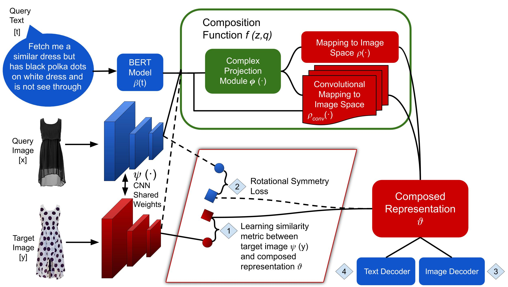

# Compositional Learning of Image-Text Query for Image Retrieval 
## Code is available.

## Introduction

One of the peculiar features of human perception is multi-modality. We unconsciously attach attributes to objects, which can sometimes uniquely identify them. 
For instance, when a person says apple, it is quite natural that an image of an apple, which may be green or red in color, forms in their mind. 
In information retrieval, the user seeks information from a retrieval system by sending a query. Traditional information retrieval systems allow a unimodal query, i.e., either a text or an image.

## Teaser Figure 


Advanced information retrieval systems should enable the users in expressing the concept in their mind by allowing a multi-modal query.

In this work, we consider such an advanced retrieval system, where users can retrieve images from a database based on a multi-modal (image-text) query. 
Specifically, the query text prompts some modification in the query image and the task is to retrieve images with the desired modifications. This task has applications in the domain of E-Commerce search, surveillance systems and internet search.

The figure on the left shows a potential application scenario of this task.
In this figure a user of an E-Commerce platform is interested in buying a dress, which should look similar to her friend’s dress, but the dress should be of white color with a ribbon sash. In this case, we would like the algorithm to retrieve some dresses with desired modifications in the query dress. 

## ComposeAE Architecture 
We propose an autoencoder based model, ComposeAE, to learn the composition of image and text query
for retrieving images. We adopt a deep metric learning approach and learn a metric that pushes composition
of source image and text query closer to the target images. We also propose a rotational symmetry constraint
on the optimization problem. 


## Results
Our approach is able to outperform the state-of-the-art method TIRG on three benchmark datasets, namely: MIT-States, Fashion200k and Fashion IQ. 
In order to ensure fair comparison, we introduce strong baselines by enhancing TIRG method. 

## Requirements and Installation
* Python 3.6
* [PyTorch](http://pytorch.org/) 1.2.0
* [NumPy](http://www.numpy.org/) (1.16.4)
* [TensorBoard](https://github.com/TeamHG-Memex/tensorboard_logger)
* Other packages can be found in [requirements.txt](https://github.com/ecom-research/ComposeAE/blob/master/requirements.txt)


## Description of the Code [(Copied From TIRG)](https://github.com/google/tirg/edit/master/README.md)

- `main.py`: driver script to run training/testing
- `datasets.py`: Dataset classes for loading images & generate training retrieval queries
- `text_model.py`: LSTM model to extract text features
- `img_text_composition_models.py`: various image text compostion models 
- `torch_function.py`: contains soft triplet loss function and feature normalization function
- `test_retrieval.py`: functions to perform retrieval test and compute recall performance

## Running the experiments 

### Download the datasets
#### MITStates dataset

Download the dataset via this [link](http://web.mit.edu/phillipi/Public/states_and_transformations/index.html) and save it in the ``data`` folder. Kindly take care that the dataset should have these files:

```data/mitstates/images/<adj noun>/*.jpg```


#### Fashion200k dataset

Download the dataset via this [link](https://github.com/xthan/fashion-200k) and save it in the ``data`` folder.
To ensure fair comparison, we employ the same test queries as TIRG. They can be downloaded from [here](https://storage.googleapis.com/image_retrieval_css/test_queries.txt). Kindly take care that the dataset should have these files:

```
data/fashion200k/labels/*.txt
data/fashion200k/women/<category>/<caption>/<id>/*.jpeg
data/fashion200k/test_queries.txt`
```

#### FashionIQ dataset

Download the dataset via this [link](https://github.com/XiaoxiaoGuo/fashion-iq) and save it in the ``data`` folder.
The dataset consists of three non-overlapping subsets, namely `dress`, `top-tee` and `shirt`. 
We join the two annotations with the text ` and it` to get a description similar to a normal sentence a user might ask on an E-Com platform. 
Furthermore, we combine the train sets of all three categories to form a bigger training set and train a single model on it. 
Analogously, we also combine the validation sets to form a single validation set. 

## Running the Code

For training & testing new models, pass the appropriate arguments. 
For instance, for training original TIRG model on MITStates dataset run the following command:

```
python -W ignore  main.py --dataset=mitstates --dataset_path=../data/mitstates/  --model=tirg --loss=soft_triplet --learning_rate_decay_frequency=50000 --num_iters=160000 --weight_decay=5e-5 --comment=mitstates_tirg_original --log_dir ../logs/mitstates/
```

For training TIRG with BERT model on MITStates dataset run the following command:

```
python -W ignore  main.py --dataset=mitstates --dataset_path=../data/mitstates/  --model=tirg --loss=soft_triplet --learning_rate_decay_frequency=50000 --num_iters=160000 --weight_decay=5e-5 --comment=mitstates_tirg_bert --log_dir ../logs/mitstates/ --use_bert True
```

For training TIRG with complete text query on MITStates dataset run the following command:

```
python -W ignore  main.py --dataset=mitstates --dataset_path=../data/mitstates/  --model=tirg --loss=soft_triplet --learning_rate_decay_frequency=50000 --num_iters=160000 --weight_decay=5e-5 --comment=mitstates_tirg_complete_text_query --log_dir ../logs/mitstates/ --use_complete_text_query True 
```

For training ComposeAE model on Fashion200k dataset run the following command:

```
python -W ignore  main.py --dataset=fashion200k --dataset_path=../data/fashion200k/  --model=composeAE --loss=batch_based_classification --learning_rate_decay_frequency=50000 --num_iters=160000 --use_bert True --use_complete_text_query True --weight_decay=5e-5 --comment=fashion200k_composeAE --log_dir ../logs/fashion200k/
```

For training RealSpaceConcatAE (ComposeAE model but with Concatenation in Real Space) on FashionIQ dataset run the following command:

```
python -W ignore  main.py --dataset=fashionIQ --dataset_path=../data/fashionIQ/  --model=RealSpaceConcatAE --loss=batch_based_classification --learning_rate_decay_frequency=8000 --num_iters=100000 --use_bert True --use_complete_text_query True --comment=fashionIQ_RealSpaceConcatAE --log_dir ../logs/fashionIQ/
```


